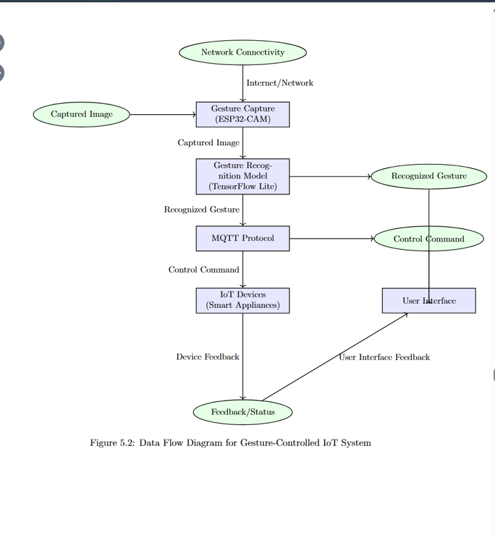
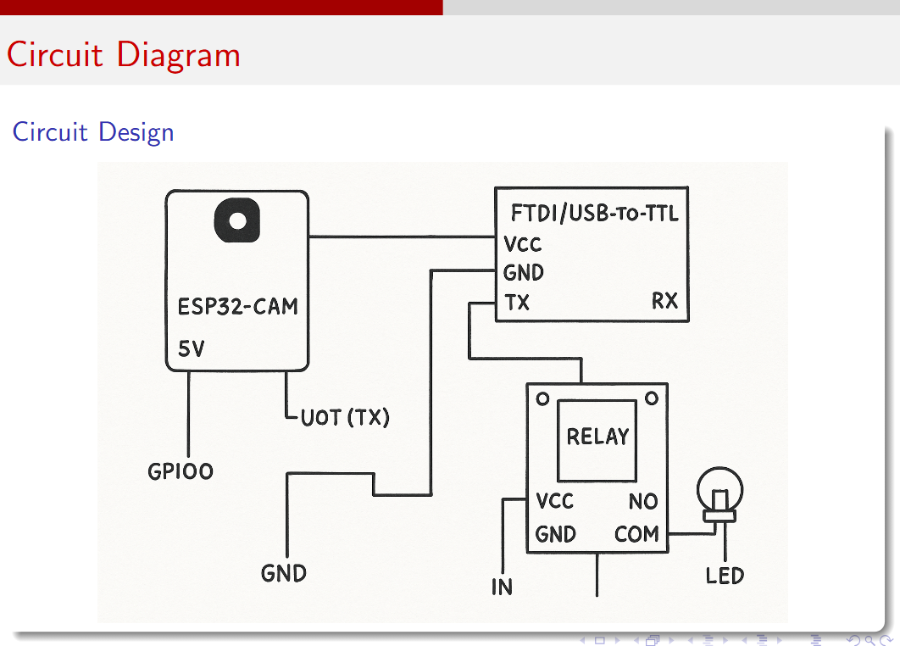

# Gesture-Based Touchless IoT Control

An AI-powered gesture recognition system using **ESP32-CAM** for **touchless control of IoT devices**.  
The system enables users to control appliances using hand gestures without physical contact.

---

## Overview

This project demonstrates a touchless IoT control mechanism where hand gestures are captured using an ESP32-CAM module, processed in real time, and mapped to control commands for IoT devices such as lights or fans.  
It is designed for smart homes, healthcare environments, and assistive technologies.

---

## Key Features

- Touchless control of IoT devices using hand gestures  
- ESP32-CAM based vision sensing  
- Real-time gesture recognition  
- Lightweight and low-cost embedded implementation  
- Suitable for smart homes and assistive environments  

---

## System Architecture

The system consists of:
- ESP32-CAM for image capture  
- Gesture recognition logic  
- IoT control module (relay / cloud / MQTT)  
- End device (appliance)  

> The system architecture diagram is available in the `assets/` folder.
> ## System Architecture

The following diagram shows the overall architecture of the gesture-based touchless IoT control system, including the ESP32-CAM, gesture processing logic, wireless communication, and IoT device control.


---

## How It Works

1. ESP32-CAM captures live video frames  
2. Frames are processed to detect hand gestures  
3. Recognized gestures are mapped to predefined actions  
4. Control signals are sent to IoT devices wirelessly  
5. Devices respond instantly without physical contact

---
## System Flow

The diagram below illustrates the end-to-end data flow of the gesture-based touchless IoT control system, from gesture capture to device actuation and feedback.



## System Flow

1. ESP32-CAM captures live video input.
2. Image frames are preprocessed for gesture detection.
3. Recognized gestures are classified using lightweight vision logic.
4. Each gesture is mapped to a predefined IoT control action.
5. Control signals are sent wirelessly to the IoT device.
6. The connected appliance responds instantly to the gesture.
## Circuit Diagram

The following circuit shows the hardware connections used in the gesture-based
touchless IoT control system, including the ESP32-CAM, USB-to-TTL module,
relay module, and controlled load.




## Technologies Used

- ESP32-CAM  
- Embedded C / Arduino  
- Python (for preprocessing / gesture logic, if applicable)  
- Computer Vision  
- IoT & Wireless Communication  

---

## Hardware Components

- ESP32-CAM module  
- Relay module (for appliance control)  
- Power supply  
- Connecting wires  
- Controlled appliance (bulb / fan / device)  

---

## Software Components

- Arduino IDE  
- ESP32 board package  
- Embedded C / Arduino  
- Python (optional, for gesture model training)  

---

## How to Run

### Prerequisites
- Python 3.8 or higher
- Arduino IDE
- ESP32 board package installed in Arduino IDE
- USB-to-TTL module (for ESP32-CAM programming)
- Stable Wi-Fi connection
- MQTT broker (public or local)

### Steps to Execute the Project

1. Clone the repository:
**```bash**
git clone https://github.com/VarriSneha/gesture-based-touchless-iot-control.git
cd gesture-based-touchless-iot-control

2.Install Python dependencies:
pip install -r requirements.txt

3.Run the gesture recognition script
python src/gesture_inference.py

4.Run the MQTT control script to send commands to IoT devices
Run the MQTT control script to send commands to IoT devices

5.Upload ESP32-CAM code:

Open Arduino IDE

Select ESP32-CAM board

Select correct COM port

Upload the file:
src/esp32_cam_gesture.ino
6.Power the ESP32-CAM and perform hand gestures in front of the camera.

7.Recognized gestures are converted into control commands and sent wirelessly to IoT devices using MQTT.

8.The connected appliance (bulb / fan / device) responds instantly without physical contact.
**```**

## Applications

- Smart home automation  
- Touchless control systems  
- Assistive technology  
- Healthcare environments  
- IoT-based human–computer interaction  

---

## Author

**Varri Sneha**  
B.Tech – Electronics and Communication Engineering  
IIIT Manipur
